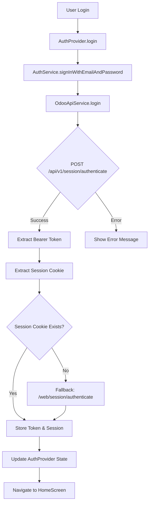
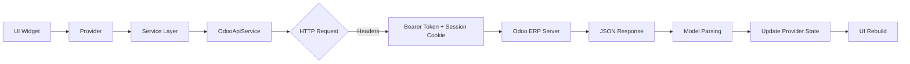
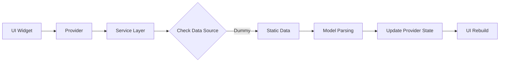

# Al-Hamra Mobile App 🕌

Aplikasi mobile komprehensif untuk manajemen Pesantren Islam (Islamic Boarding School), dibangun dengan Flutter dan terintegrasi dengan Odoo ERP. Aplikasi ini berfungsi sebagai platform digital yang menghubungkan orang tua dengan perjalanan pendidikan anak-anak mereka di Pesantren Al-Hamra.

---

## 📋 Ringkasan Eksekutif

**Alhamra Mobile** adalah aplikasi mobile berbasis Flutter untuk manajemen pesantren yang mengintegrasikan sistem ERP Odoo dengan aplikasi mobile. Aplikasi ini dirancang untuk menghubungkan orang tua dengan perjalanan pendidikan anak-anak mereka di Pesantren Al-Hamra.

### 🔧 Teknologi Utama
- **Frontend**: Flutter 3.8.1+ dengan Dart
- **Backend**: Odoo ERP v16 (https://v16alhamra.cendana2000.id)
- **Database**: Odoo PostgreSQL (db_sipp)
- **State Management**: Provider Pattern
- **Storage**: SharedPreferences untuk data lokal
- **UI Framework**: Material Design 3 dengan Google Fonts (Poppins)
- **News API**: NewsData.io (External API)

---

## 🏗️ Arsitektur Project

### Struktur Folder

```
lib/
├── app/                    # Konfigurasi aplikasi
│   ├── config/            # Routes, app config, odoo config
│   └── constants/         # Konstanta aplikasi
├── core/                  # Core functionality
│   ├── data/             # Data sources & services (12 files)
│   ├── localization/     # Multi-language support (ID/EN)
│   ├── models/           # Data models (19 models)
│   ├── providers/        # State management (AuthProvider)
│   ├── services/         # Business logic services (8 services)
│   └── utils/            # Utilities & styling
└── features/             # Feature modules (14 modules)
    ├── akademik/         # Academic features
    ├── aktivitas/        # Activities (8 screens)
    ├── auth/             # Authentication (3 screens)
    ├── beranda/          # Dashboard/Home
    ├── facilities/       # Facilities info (2 screens)
    ├── history/          # Transaction history (6 screens)
    ├── home/             # Main navigation
    ├── menu/             # Menu pages (9 screens)
    ├── news/             # News & announcements (2 screens)
    ├── notifications/    # Notifications (3 screens)
    ├── payment/          # Payment system (7 screens)
    ├── profile/          # User profile (11 screens)
    ├── shared/           # Shared widgets (18 widgets)
    └── topup/            # Top-up wallet (3 screens)
```

**Total**: 101+ Dart files, 45+ screens/pages, 19 models, 8 core services, 12 data services

---

## 🎯 Fitur Utama

### 👨‍👩‍👧‍👦 Untuk Orang Tua
1. ✅ **Multi-Child Support** - Kelola beberapa anak sekaligus
2. ✅ **Real-time Monitoring** - Pantau aktivitas santri
3. ✅ **Digital Wallet** - Manajemen top-up dan pembayaran
4. ✅ **Academic Tracking** - Nilai, kehadiran, jadwal
5. ✅ **Islamic Education** - Tracking Tahfidz, Tahsin, Mutabaah
6. ✅ **Communication** - Berita, pengumuman, notifikasi
7. ✅ **Financial Management** - Tagihan, pembayaran, riwayat transaksi
8. ✅ **Profile Management** - Edit profil, ubah password

### 👨‍🎓 Untuk Santri
1. ✅ **Personal Profile** - Informasi lengkap santri
2. ✅ **Academic Info** - Mata pelajaran, jadwal, nilai
3. ✅ **Attendance** - Tracking kehadiran real-time
4. ✅ **Tahfidz Quran** - Progress hafalan
5. ✅ **Tahsin Quran** - Perbaikan bacaan
6. ✅ **Mutabaah** - Tracking ibadah harian
7. ✅ **Activities** - Ekstrakurikuler dan event
8. ✅ **Pocket Money** - Manajemen uang saku digital

---

## 📊 Data Sources & Integration

### 🔄 Data Flow Architecture

Aplikasi ini menggunakan **hybrid data approach** dengan kombinasi:
- **Real Data** dari Odoo ERP API
- **Dummy/Sample Data** untuk development dan fallback
- **External API** (NewsData.io) untuk berita

### Data Source Mapping

| Fitur | Data Source | Status | Endpoint/Service |
|-------|-------------|--------|------------------|
| **Authentication** | ✅ Odoo API | REAL | `/api/v1/session/authenticate` |
| **User Profile** | ✅ Odoo API | REAL | `/api/v1/me` |
| **Student List** | ✅ Odoo API + Dummy Fallback | HYBRID | `/api/v1/orangtua/anak` |
| **Student Profile** | ✅ Odoo API | REAL | `/api/v1/siswa/{id}/profil` |
| **Tagihan/Bills** | ✅ Odoo API | REAL | `/api/v1/siswa/{id}/tagihan` |
| **Tahfidz** | ✅ Odoo API | REAL | `/api/v1/siswa/{id}/tahfidz` |
| **Canteen Transactions** | ✅ Odoo API | REAL | `/api/v1/siswa/{id}/transaksi_kantin` |
| **News/Berita** | ✅ NewsData.io + Sample | HYBRID | `newsdata.io/api/1/news` |
| **Facilities** | ⚠️ Sample Data | DUMMY | `news_service.dart` |
| **Dashboard Overview** | ⚠️ Sample Data | DUMMY | `dashboard_data.dart` |
| **Mutabaah** | ⚠️ Service Ready | READY | `mutabaah_service.dart` |
| **Kesehatan** | ⚠️ Service Ready | READY | `kesehatan_service.dart` |
| **Pelanggaran** | ⚠️ Service Ready | READY | `pelanggaran_service.dart` |
| **Perizinan** | ⚠️ Service Ready | READY | `perizinan_service.dart` |
| **Pocket Money** | ⚠️ Service Ready | READY | `pocket_money_service.dart` |

### Legend:
- ✅ **REAL**: Menggunakan data dari Odoo API
- ⚠️ **DUMMY**: Menggunakan sample/static data
- 🔄 **HYBRID**: Odoo API dengan fallback ke dummy data
- 🔧 **READY**: Service sudah siap, tinggal integrasi endpoint

---

## 🔐 Authentication & Data Flow

### Authentication Flow



### Dual Authentication System

Aplikasi menggunakan **dual authentication** untuk kompatibilitas maksimal:

1. **Bearer Token** (REST API)
   - Untuk REST API endpoints
   - Stored di SharedPreferences (`odoo_auth_token`)
   - Digunakan di header: `Authorization: Bearer {token}`

2. **Session Cookie** (Web Session)
   - Untuk web-based endpoints
   - Stored di SharedPreferences (`odoo_session_id`)
   - Digunakan di header: `Cookie: session_id={session}`

### Data Fetching Flow (Real Data)



### Data Fetching Flow (Dummy Data)



---

## 🔧 Backend Integration Details

### Odoo ERP Configuration

```dart
baseUrl: 'https://v16alhamra.cendana2000.id/'
database: 'db_sipp'
timeout: 30 seconds
```

### API Endpoints (Odoo)

#### Authentication
```
POST /api/v1/session/authenticate     # Login (REST)
POST /web/session/authenticate        # Login (Web fallback)
POST /web/session/destroy             # Logout
GET  /api/v1/me                       # Get current user
```

#### Student Management
```
GET  /api/v1/orangtua/anak                    # Get children list
GET  /api/v1/siswa/{id}/profil                # Get student profile
POST /web/dataset/call_kw                     # Generic Odoo RPC
```

#### Academic & Islamic Education
```
GET  /api/v1/siswa/{id}/tahfidz               # Tahfidz history
GET  /api/v1/siswa/{id}/tahsin                # Tahsin records (ready)
GET  /api/v1/siswa/{id}/mutabaah              # Mutabaah tracking (ready)
GET  /api/v1/siswa/{id}/nilai                 # Academic grades (ready)
GET  /api/v1/siswa/{id}/absensi               # Attendance (ready)
```

#### Financial
```
GET  /api/v1/siswa/{id}/tagihan               # Bills/invoices
GET  /api/v1/siswa/{id}/transaksi_kantin      # Canteen transactions
GET  /api/v1/siswa/{id}/uang_saku             # Pocket money (ready)
GET  /api/v1/siswa/{id}/dompet                # Wallet (ready)
```

#### Other
```
GET  /api/v1/siswa/{id}/kesehatan             # Health records (ready)
GET  /api/v1/siswa/{id}/pelanggaran           # Violations (ready)
GET  /api/v1/siswa/{id}/perizinan             # Permissions (ready)
```

### External APIs

#### NewsData.io (News Service)
```
GET  https://newsdata.io/api/1/news
     ?apikey={key}
     &country=id
     &language=id
     &size=10
```

**Features:**
- Real news dari Indonesia
- Fallback ke sample data jika API error
- Categories: general, pendidikan, kegiatan, prestasi, dll

---

## 📦 Dependencies

### Core (4)
```yaml
flutter_sdk: ^3.8.1
flutter_localizations: sdk
cupertino_icons: ^1.0.8
http: ^1.1.0                    # HTTP requests
```

### State Management & Storage (2)
```yaml
provider: ^6.1.5                # State management
shared_preferences: ^2.5.3      # Local storage
```

### UI/UX (6)
```yaml
google_fonts: ^6.3.0            # Typography (Poppins)
flutter_svg: ^2.2.0             # SVG support
persistent_bottom_nav_bar: any  # Bottom navigation
loading_animation_widget: ^1.3.0 # Loading animations
font_awesome_flutter: ^10.9.0   # Icons
cached_network_image: ^3.4.1    # Image caching
```

### Charts & Calendar (3)
```yaml
syncfusion_flutter_charts: ^31.1.17
fl_chart: ^0.68.0
table_calendar: ^3.0.9
```

### Utilities (2)
```yaml
intl: ^0.20.2                   # Internationalization
url_launcher: ^6.3.2            # Launch URLs
```

### PDF & File Management (6)
```yaml
pdf: ^3.10.8                    # PDF generation
path_provider: ^2.1.2           # Path utilities
image: ^4.1.7                   # Image processing
screenshot: ^3.0.0              # Screenshot capture
permission_handler: ^11.3.1     # Permissions
file_saver: ^0.2.1              # Save files
share_plus: ^12.0.0             # Share functionality
saver_gallery: ^4.0.1           # Save to gallery
```

**Total**: 24 dependencies

---

## 🎨 Design System

### Color Palette
```dart
Primary:    #288DE5  // Light Blue (Gradient start)
Secondary:  #164E7F  // Dark Blue (Gradient end)
Accent:     #FFC107  // Amber
Danger:     #EE6868  // Red
Background: #FFFFFF  // White
```

### Typography (Google Fonts Poppins)
- **Heading 1**: 20-24px, Bold
- **Heading 2**: 18-20px, Bold
- **Subheading**: 14-16px, Regular
- **Body**: 12-14px, Regular
- **Caption**: 10-12px, Regular

### Responsive Design
- **Small**: < 360px (3 columns grid)
- **Medium**: 360-414px (4 columns grid)
- **Large**: >= 414px (4 columns grid)

---

## 🌐 Internationalization (i18n)

### Supported Languages
- 🇮🇩 **Indonesia** (id_ID) - Default
- 🇬🇧 **English** (en_US)

### Localization Files
```
core/localization/
├── app_localizations.dart       # Base
├── app_localizations_id.dart    # Indonesian
└── app_localizations_en.dart    # English
```

---

## 📱 Platform Support

- ✅ **Android** (API 23+)
- ✅ **iOS** (iOS 12.0+)
- ✅ **Web**
- ✅ **Windows**
- ✅ **Linux**
- ✅ **macOS**

---

## 🚀 Installation & Setup

### 1. Clone Repository
```bash
git clone https://github.com/yourusername/alhamra-mobile-app.git
cd alhamra-mobile-app
```

### 2. Install Dependencies
```bash
flutter pub get
```

### 3. Odoo Configuration
Update `lib/app/config/odoo_config.dart`:
```dart
static const String baseUrl = 'YOUR_ODOO_URL';
static const String database = 'YOUR_DATABASE';
```

### 4. Run Application
```bash
# Debug mode
flutter run

# Release mode
flutter run --release

# Specific device
flutter run -d <device_id>
```

---

## 🔄 Migration Guide: Dummy → Real Data

### Step 1: Identify Dummy Data Services

Services yang masih menggunakan dummy data:
- `dashboard_data.dart` - Dashboard overview
- `news_service.dart` - Facilities data (getFacilities)
- `student_data.dart` - Static student list

### Step 2: Implement Odoo API Endpoints

Untuk migrasi ke real data, tambahkan endpoint di Odoo:

```python
# Odoo Controller Example
@http.route('/api/v1/siswa/<int:siswa_id>/dashboard', 
            type='json', auth='user', methods=['GET'])
def get_dashboard_overview(self, siswa_id):
    # Implement dashboard data aggregation
    return {
        'success': True,
        'data': {
            'keuangan': {...},
            'kesantrian': {...},
            'akademik': {...}
        }
    }
```

### Step 3: Update Service Layer

```dart
// Before (Dummy)
factory DashboardData.getSampleData() {
  return DashboardData(...);
}

// After (Real)
Future<DashboardData> fetchDashboardData(String siswaId) async {
  final response = await http.get(
    Uri.parse('$baseUrl/api/v1/siswa/$siswaId/dashboard'),
    headers: {...}
  );
  return DashboardData.fromJson(response.data);
}
```

### Step 4: Update UI Layer

```dart
// Before
final data = DashboardData.getSampleData();

// After
FutureBuilder<DashboardData>(
  future: dashboardService.fetchDashboardData(siswaId),
  builder: (context, snapshot) {
    if (snapshot.hasData) {
      return DashboardWidget(data: snapshot.data!);
    }
    return LoadingWidget();
  },
)
```

---

## 🧪 Testing Strategy

### Current Status
⚠️ **No automated tests yet**

### Recommended Testing Approach

```bash
# Unit tests
flutter test

# Integration tests
flutter test integration_test/

# Generate coverage
flutter test --coverage
```

### Test Structure (Recommended)
```
test/
├── unit/
│   ├── models/
│   ├── services/
│   └── providers/
├── widget/
│   └── screens/
└── integration/
    └── flows/
```

---

## 📈 Performance Optimizations

### Implemented
- ✅ Image caching (`cached_network_image`)
- ✅ Local data caching (SharedPreferences)
- ✅ Responsive design (adaptive layouts)
- ✅ Lazy loading untuk lists
- ✅ Efficient state management (Provider)

### Recommended
- ⚠️ Implement pagination untuk large datasets
- ⚠️ Add offline-first approach
- ⚠️ Implement data compression
- ⚠️ Add analytics & crash reporting

---

## 🔮 Roadmap & Future Enhancements

### Phase 1: Core Improvements
- [ ] **Complete API Integration** - Migrate semua dummy data ke Odoo API
- [ ] **Offline Support** - Implement offline-first architecture
- [ ] **Push Notifications** - Firebase Cloud Messaging
- [ ] **Unit & Integration Tests** - Minimum 80% coverage

### Phase 2: Feature Enhancements
- [ ] **Video Streaming** - Untuk kelas online
- [ ] **Chat System** - Komunikasi orang tua-guru
- [ ] **Advanced Analytics** - Dashboard analytics untuk admin
- [ ] **Document Management** - Upload/download dokumen

### Phase 3: Platform Expansion
- [ ] **Multi-language** - Tambah bahasa Arab
- [ ] **Dark Mode** - Theme switching
- [ ] **Accessibility** - Screen reader support
- [ ] **Desktop Apps** - Native Windows/macOS apps

---

## 🛡️ Security & Best Practices

### Implemented
- ✅ Dual authentication (Token + Session)
- ✅ Secure token storage (SharedPreferences)
- ✅ HTTPS only communication
- ✅ Session timeout handling
- ✅ HTML response detection (anti-redirect)

### Recommended
- ⚠️ Implement data encryption for sensitive data
- ⚠️ Add biometric authentication
- ⚠️ Implement certificate pinning
- ⚠️ Add rate limiting
- ⚠️ Implement proper error logging

---

## 📊 Technical Metrics

### Code Statistics
- **Total Dart Files**: 101+
- **Total Models**: 19
- **Total Services**: 20 (8 core + 12 data)
- **Total Providers**: 1 (AuthProvider)
- **Total Screens/Pages**: 45+
- **Total Feature Modules**: 14
- **Total Shared Widgets**: 18
- **Lines of Code**: ~10,000+ (estimated)

### Dependencies
- **Total Dependencies**: 24
- **Dev Dependencies**: 1 (flutter_lints)
- **SDK Dependencies**: 2 (flutter, flutter_localizations)

---

## 🎯 Key Strengths

1. ✅ **Comprehensive Features** - Mencakup semua aspek manajemen pesantren
2. ✅ **Modern Architecture** - Clean architecture dengan separation of concerns
3. ✅ **Scalable** - Modular structure memudahkan pengembangan
4. ✅ **Professional UI/UX** - Material Design 3 dengan responsive design
5. ✅ **Robust Integration** - Dual authentication dengan Odoo ERP
6. ✅ **Multi-platform** - Support Android, iOS, Web, Desktop
7. ✅ **Internationalization** - Multi-language ready
8. ✅ **Hybrid Data Approach** - Kombinasi real data + fallback

---

## ⚠️ Areas for Improvement

1. **Testing** - Belum ada unit tests atau integration tests
2. **Documentation** - Inline documentation bisa ditingkatkan
3. **Offline Support** - Belum ada offline-first approach
4. **Performance Monitoring** - Belum ada analytics/crash reporting
5. **Security** - Bisa ditambahkan encryption untuk sensitive data
6. **CI/CD** - Belum ada automated build/deployment pipeline
7. **API Coverage** - Beberapa fitur masih menggunakan dummy data

---

## 👥 Contributing

We welcome contributions! Please follow these steps:

1. **Fork** the repository
2. **Create** a feature branch (`git checkout -b feature/amazing-feature`)
3. **Commit** your changes (`git commit -m 'Add amazing feature'`)
4. **Push** to the branch (`git push origin feature/amazing-feature`)
5. **Open** a Pull Request

### Code Style Guidelines
- Follow [Dart Style Guide](https://dart.dev/guides/language/effective-dart/style)
- Use meaningful variable and function names
- Add comments for complex logic
- Maintain consistent indentation (2 spaces)
- Update documentation when adding features

---

## 📄 License

This project is licensed under the MIT License - see the [LICENSE](LICENSE) file for details.

---

## 📞 Support

### Contact
- **Email**: support@alhamra-app.com
- **Documentation**: [GitHub Wiki](https://github.com/yourusername/alhamra-mobile-app/wiki)
- **Issues**: [GitHub Issues](https://github.com/yourusername/alhamra-mobile-app/issues)

### Development Team
- **Mobile**: Flutter Development Team
- **Backend**: Odoo ERP Integration Team
- **UI/UX**: Design Team
- **QA**: Quality Assurance Team

---

## 🌟 Version History

### v1.0.0 (Current)
- ✅ Authentication system (Odoo integration)
- ✅ Student management (multi-child support)
- ✅ News and announcements (NewsData.io)
- ✅ Facility information
- ✅ Payment integration (Odoo API)
- ✅ Tahfidz tracking (Odoo API)
- ✅ Canteen transactions (Odoo API)
- ✅ Multi-language support (ID/EN)
- ✅ Responsive design (all screen sizes)

---

## 🙏 Acknowledgments

**Dibuat dengan ❤️ untuk komunitas Pesantren Al-Hamra**

*"Dan barangsiapa bertawakkal kepada Allah, niscaya Allah akan mencukupkan (keperluan)nya. Sesungguhnya Allah melaksanakan urusan-Nya."* - QS. At-Talaq: 3

---

## 📚 Additional Resources

### Documentation
- [Flutter Documentation](https://docs.flutter.dev/)
- [Odoo Documentation](https://www.odoo.com/documentation/16.0/)
- [Provider Package](https://pub.dev/packages/provider)
- [Material Design 3](https://m3.material.io/)

### Tools
- [Flutter DevTools](https://docs.flutter.dev/tools/devtools)
- [Odoo Studio](https://www.odoo.com/page/studio)
- [NewsData.io API](https://newsdata.io/documentation)

---

**Last Updated**: November 2025
**Version**: 1.0.0
**Status**: Production Ready (with some features in development)
